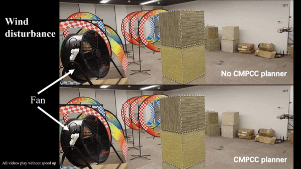

# CMPCC
Corridor-based Model Predictive Contouring Control for Aggressive Drone Flight

## Overview
CMPCC is an efficient, receding horizon, local adaptive low level planner as the middle layer between our original planner and controller. It features: 
-  online flight speed optimization
-  strict safety and feasibility
-  real-time performance




Complete video: [cmpcc-video](https://www.youtube.com/watch?v=_7CzBh-0wQ0)

paper summited: [cmpcc-paper](https://arxiv.org/abs/2007.03271) 

### File Structure
- **src/cmpcc**: key module of CMPCC, which is a single ros package 
- **src/simualtion**: a lightweight simulator for quadrotors 
- **src/utils**: some functional codes and plugins
- **osqp**: a copy of [OSQP](https://osqp.org/) source code for solving qp problem.

## Prerequisites
Our software is developed and tested in Ubuntu 18.04, ROS Melodic. Other version may require minor modification. 

You can clone this 
```
git clone https://github.com/ZJU-FAST-Lab/CMPCC.git
cd CMPCC
```
To install the following dependencies, you can run the auto-install script by
```
chmod +x install_tools.sh
./install_tools.sh
```
If failed, you can manually install them one by one:
- install dependencies
```
sudo apt-get install libyaml-cpp-dev
sudo apt-get install libarmadillo-dev
```
- install osqp
```
cd osqp
mkdir build
cd build
cmake -G "Unix Makefiles" ..
cmake --build .
sudo cmake --build . --target install
```

## Build on ROS
After the prerequisites are satisfied, you can catkin_make in this repository directory, which is already a ros-workspace:
```
catkin_make
``` 

## Run the Simulation
```
source devel/setup.bash
./simulation.sh
```

